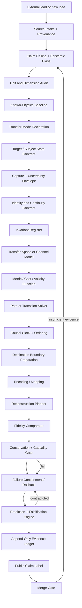

# AXM Matter-Transfer Set — Geometry–State Architecture v0.1

**Status:** research architecture; simulation-first; evidence-bounded  
**Date:** 2026-08-16  
**Placement:** AXM Factual Star Adventure Simulator research branch  
**Canonical claim ceiling:** this document does **not** establish physical matter teleportation.

## 1. Purpose

The matter-transfer set should not begin with “make an object disappear here and appear there.” It should begin with a harder, testable architecture question:

> What state is being transferred, through what lawful channel or modeled transition space, under which invariants, with what uncertainty, and how is the destination result verified?

That reframing preserves the unusual possibility while preventing metaphor, visual similarity, unit tricks, or a successful software reconstruction from being mislabeled as new physics.

## 2. Truth boundary

This architecture separates three zones.

| Zone | Meaning | Allowed result |
|---|---|---|
| **G — Grounded** | Established mathematics, measurement practice, electromagnetism, relativity, information transfer, and experimentally demonstrated quantum-state teleportation within its real limits. | Factual simulation constraints and verified reference behavior. |
| **M — Modeling bridge** | Deterministic representations, state schemas, transfer graphs, metrics, error envelopes, reconstruction logic, and test harnesses. | Internally valid models and simulations; not claims about nature. |
| **S — Speculative frontier** | Informational geometry, harmonic reconciliation, extra-dimensional standing-wave models, spacetime shortcuts, or unknown carriers. | Explicit hypotheses with equations, predictions, and falsifiers; never default facts. |

Hard exclusions for this version:

- no claim that bulk matter transfer exists;
- no biological or live-subject application;
- no destructive scanning experiments;
- no weapon, confinement, or harmful hardware-control path;
- no “c = π” or other unit-selected numerical identity treated as a physical derivation;
- no statement that a photon has a valid rest frame or consciousness;
- no promotion from visual resemblance to physical mechanism.

## 3. Transfer-mode ladder

The word “transfer” collapses very different things. Every experiment or simulation must declare one mode before it runs.

| Mode | Name | Current status |
|---|---|---|
| **MT-0** | Symbolic state transfer between software components | Grounded and buildable now |
| **MT-1** | Classical information transmission and reconstruction | Grounded and buildable now |
| **MT-2** | Conventional physical relocation of matter | Grounded; transport rather than teleportation |
| **MT-3** | Quantum-state teleportation using entanglement plus classical communication | Experimentally grounded for quantum states; not bulk-matter transport |
| **MT-4** | Scan-and-reconstruct matter model | Modeling/speculative; no live or destructive trials |
| **MT-5** | Nondestructive bulk matter transfer | Speculative |
| **MT-6** | Spacetime shortcut, portal, or nonlocal matter path | Speculative |

A result in one mode may not be reported as success in a higher mode.

## 4. Architecture map

## 5. Layer contracts

### Layer A — Source and claim intake

**Input:** post, paper, measurement, equation, diagram, simulation result, or human idea.  
**Output:** a source packet containing origin, capture date, authority level, exact claim, paraphrase, source hash where available, and privacy/licensing boundary.

Required behavior:

1. Separate what the source reports from what AXM infers.
2. Preserve the original claim without silently strengthening it.
3. Link secondary commentary to primary sources when possible.
4. Give every claim a maximum allowed public wording.

### Layer B — Unit and dimension audit

This layer blocks false depth created by selected units.

Checks include:

- dimensional consistency;
- unit conversion reproducibility;
- dimensionless versus dimensional quantities;
- significant figures and uncertainty;
- hidden normalization choices;
- whether a numerical resemblance survives a legitimate change of units.

Example: in megametres per centisecond, the exact SI value of the speed of light is `2.99792458 Mm/cs`, not `π Mm/cs`. Choosing a ruler and clock can change the numerical value of a dimensional constant; numerical resemblance alone is not a physical derivation.

### Layer C — Known-physics baseline

The baseline does not prove a transfer hypothesis. It defines what the hypothesis must reproduce or explicitly depart from.

Minimum baseline modules:

- SI constants and unit definitions;
- Maxwell-equation electromagnetic propagation;
- geometric-optics limit;
- null paths and affine parameterization;
- causal ordering and finite classical signalling;
- applicable conservation laws;
- quantum-state teleportation as a separate, bounded mode.

For an ideal lightlike path, the spacetime interval is null. This does not create a photon rest frame, remove the distinction between emission and reception events, or establish instantaneous matter transfer.

### Layer D — State contract

The “thing” must be represented before transfer can be discussed.

A state contract may contain:

- spatial geometry and topology;
- composition and material phases;
- fields and boundary conditions;
- thermodynamic state;
- charge, momentum, angular momentum, and other applicable quantities;
- internal relations and dependencies;
- uncertainty and missing measurements;
- identity/continuity markers;
- forbidden or unknowable fields.

The contract must distinguish:

- **same continuing entity**;
- **reconstructed copy**;
- **derived approximation**;
- **visually similar output**;
- **state-equivalent only under a declared measurement set**.

### Layer E — Invariant register

Each mode declares what must remain invariant, what may transform, and what is not known.

The register may include:

- dimensional validity;
- energy and momentum accounting;
- electric charge;
- causal ordering;
- topology;
- information budget;
- entropy accounting;
- endpoint resource requirements;
- reconstruction tolerances.

An unknown cannot be converted into a pass. Missing conservation or uncertainty information produces `UNRESOLVED`, not `VALID`.

### Layer F — Transfer space and metric

The architecture allows several transfer spaces without treating them as physically equivalent:

- physical spacetime;
- a communication network;
- a state-transition graph;
- phase space;
- Hilbert-space state mapping;
- a speculative manifold.

Every space must define:

1. coordinates or state identifiers;
2. legal transitions;
3. a metric, cost, action, or validity function;
4. boundary conditions;
5. singular/undefined regions;
6. how observations map back to measurable quantities.

“Geometry” becomes useful only after these items exist.

### Layer G — Path and causal solver

The solver may seek a shortest path, stationary path, least-cost path, dynamically valid trajectory, or transition sequence. It must never call a path “geodesic” merely because it is curved or visually elegant.

Outputs include:

- proposed transition path;
- assumptions;
- accumulated cost/action;
- violated constraints;
- timing and causal order;
- sensitivity to perturbation;
- whether a solution is unique, multiple, or absent.

### Layer H — Channel/carrier model

The model states what actually carries the transferable state.

Possible declared carriers:

- classical signal;
- transported material;
- electromagnetic field;
- entanglement-assisted quantum protocol;
- local deterministic simulation bus;
- speculative field or structure.

For speculative carriers the required fields are stricter: governing equation, coupling, energy accounting, measurable signature, and falsifier.

### Layer I — Endpoint and reconstruction

The destination cannot be an empty magic box. It needs:

- material and energy inventory;
- boundary conditions;
- clock synchronization;
- assembly or state-preparation mechanism;
- error correction;
- contamination controls;
- abort state;
- provenance of every reconstructed component.

The reconstruction planner must report whether it created continuity, a copy, an approximation, or only a rendering.

### Layer J — Verification and falsification

A transfer attempt produces no binary “worked” flag by default. It produces a verification packet:

- declared mode;
- expected observables;
- actual observables;
- residual error;
- invariant checks;
- causal checks;
- identity/continuity result;
- alternative explanations;
- predicted failure signature;
- independent replication status;
- maximum allowed claim.

Promotion requires a prediction that was fixed before the result and an observation that could have contradicted it.

## 6. Facebook lead intake

The supplied Facebook capture is useful as a **research lead and method prompt**, not as primary evidence. Its strongest reusable contribution is the demand for:

- a governing equation;
- a declared metric or field;
- reproduction of Maxwell’s equations and relativity where applicable;
- a new numerical prediction;
- an observation that could prove the proposal wrong.

The raw screenshots are not included in the public repository because they contain third-party Facebook interface material and a visible tagged name. A separate intake note records content hashes and a bounded paraphrase without publishing the personal/social layer.

## 7. Initial assembly profiles

### Profile A — Truth-preserving research notebook

Required organs:

- source intake;
- claim ceiling;
- unit audit;
- physics baseline;
- prediction/falsification;
- evidence ledger;
- public claim label.

### Profile B — Deterministic matter-transfer simulator

Adds:

- state contract;
- uncertainty envelope;
- invariant register;
- transfer-space registry;
- metric evaluator;
- path solver;
- endpoint preparation;
- reconstruction planner;
- fidelity comparator;
- rollback.

### Profile C — Game or visual experience

Uses Profile B but exposes only truth-labelled visuals:

- **grounded mechanic**;
- **model assumption**;
- **speculative mechanic**;
- **unknown/unresolved**.

A fun portal effect may exist while the underlying interface still says it is fictional or speculative.

### Profile D — Non-destructive experimental bench

Not enabled in v0.1. Any future activation requires:

- no biological subjects;
- no destructive scan;
- independent safety review;
- measurable low-energy test;
- explicit abort and containment;
- external scientific review before any claim promotion.

## 8. Promotion gates

A speculative model may move toward plausibility only when all of the following exist:

1. explicit variables and units;
2. governing equations;
3. boundary and initial conditions;
4. known-physics recovery limit;
5. energy/conservation accounting;
6. a novel quantitative prediction;
7. a predeclared falsifier;
8. reproducible code or calculation;
9. independent replication path;
10. no stronger claim than the evidence allows.

No vote, visual result, AI confidence, or philosophical appeal can bypass these gates.

## 9. Initial research questions

1. What minimum state description is sufficient for each transfer mode?
2. Which invariants are universal, and which depend on the model?
3. How should AXM represent identity continuity without pretending philosophy has one settled answer?
4. Can transfer-space metrics be compared without confusing mathematical convenience with physical reality?
5. Which simple non-biological systems make useful test fixtures?
6. Which speculative models recover Maxwell and relativity in their established domains?
7. What observation would decisively distinguish an informational-geometry model from an ordinary field or signal model?
8. How should uncertainty compound across capture, channel, and reconstruction?
9. Can a failed transfer produce useful evidence without destroying the source state?
10. What public wording prevents “simulation success” from becoming “teleportation achieved”?

## 10. Primary anchors

- BIPM, SI defining constants and the exact value of the speed of light:  
  https://www.bipm.org/en/measurement-units/si-defining-constants
- University of Maryland general-relativity notes on geodesics, null paths, and affine parameters:  
  https://physics.umd.edu/grt/taj/675e/675bnotes.html
- MIT OpenCourseWare, Chapter 13 on Maxwell’s equations and electromagnetic waves:  
  https://ocw.mit.edu/courses/8-02-physics-ii-electricity-and-magnetism-spring-2007/resources/chapte13em_waves/
- Bennett et al., “Teleporting an unknown quantum state via dual classical and Einstein-Podolsky-Rosen channels,” *Physical Review Letters* 70, 1895 (1993):  
  https://doi.org/10.1103/PhysRevLett.70.1895

## 11. Merge posture

This document is a proposed research architecture. It may be reviewed and expanded, but it must not be merged as proof that matter transfer is physically available. Machine integration should follow only after local reseal, acceptance tests, source-registry linkage, and Merge Gate review.
